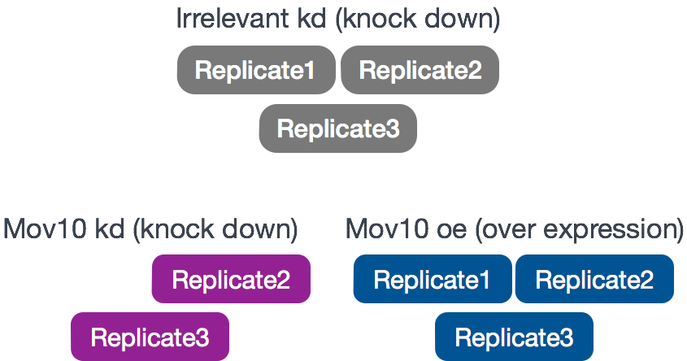
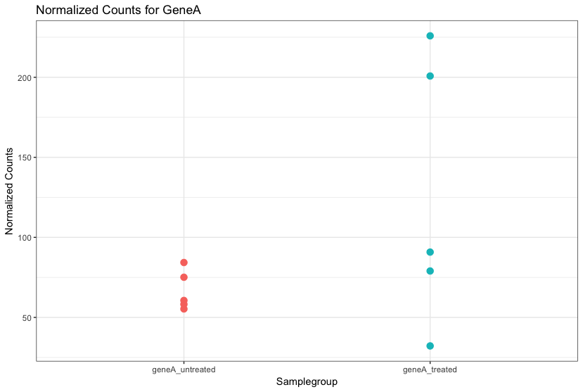

[GEO]: https://www.ncbi.nlm.nih.gov/geo/query/acc.cgi?acc=GSE51443 "Gene Expression Omnibus"
[SRA]: https://trace.ncbi.nlm.nih.gov/Traces/sra/?study=SRP031507 "Sequence Read Archive"

Приблизительное время: 60 минут

## Цели урока

* Объяснить эксперимент и его цели
* Описать, как запустить проект RNA-seq в R
* Описать RNA-seq и процедуру _(workflow)_ анализа дифференциальной экспрессии генов
* Объяснить, почему отрицательное биномиальное распределение используется для моделирования данных о числе прочтений RNA-seq


# Обзор анализа дифференциальной экспрессии генов (Differential Gene Expression, DGE)

Задачей RNA-seq зачастую является оценка дифференциальной экспрессии с целью определить, какие гены экспрессируются на разных уровнях при разных состояниях _(conditions)_. Эти гены могут дать биологическое представление о процессах, на которые влияет интересующее(ие) состояние(я).


Для определения уровней экспрессии генов наша процедура RNA-seq следовала шагам, подробно описанным на рисунке ниже. Все шаги выполнялись в командной строке (Linux/Unix) вплоть до вычисления количества прочтений для каждого гена. Анализ дифференциальной экспрессии и любой последующий функциональный анализ обычно выполняются в среде R с использованием пакетов R _(R packages)_, специально разработанных для сложного статистического анализа, который необходим для определения дифференциальной экспрессии генов.


В следующих нескольких уроках мы пройдем с вами **весь процесс анализа дифференциальной экспрессии в RNA-seq на уровне генов** с использованием различных пакетов R. Мы начнем с целочисленной матрицы прочтений _(count matrix)_, проведем предварительный анализ данных для оценки качества и выяснения взаимосвязи между образцами, выполним анализ дифференциальной экспрессии и визуально изучим результаты перед проведением последующего функционального анализа.


## Описание набора данных

Мы будем использовать общую целочисленную матрицу прочтений _(count matrix)_ из набора данных RNA-Seq, который является частью более крупного исследования, описанного в статье [Kenny PJ et al, Cell Rep 2014](http://www.ncbi.nlm.nih.gov/pubmed/25464849).

Исследование RNA-Seq проводилось на клетках HEK293F, которые были трансфицированы либо трансгеном MOV10, либо [малой интерферирующей РНК](https://ru.wikipedia.org/wiki/%D0%9C%D0%B0%D0%BB%D1%8B%D0%B5_%D0%B8%D0%BD%D1%82%D0%B5%D1%80%D1%84%D0%B5%D1%80%D0%B8%D1%80%D1%83%D1%8E%D1%89%D0%B8%D0%B5_%D0%A0%D0%9D%D0%9A) _(siRNA)_ для нокдауна _(knock down)_ Mov10, либо неспецифической (нерелевантной) siRNA. В результате были получены 3 состояния _(condition)_ **Mov10 oe** (избыточная экспрессия), **Mov10 kd** (нокдаун) и **Irrelevant kd**, соответственно. Число биологических повторов _(Replicate)_ указано ниже.

С помощью этих данных мы вычислим транскрипционные паттерны, связанные с нарушением экспрессии MOV10. Обратите внимание, что нерелевантная siRNA будет рассматриваться в качестве контрольного состояния.



***Каково назначение этих датасетов? Какое действие оказывает Mov10?***

Авторы исследуют взаимодействия между различными генами, вовлеченными в формирование [синдрома ломкой X-хромосомы](https://ru.wikipedia.org/wiki/%D0%A1%D0%B8%D0%BD%D0%B4%D1%80%D0%BE%D0%BC_%D0%9C%D0%B0%D1%80%D1%82%D0%B8%D0%BD%D0%B0_%E2%80%94_%D0%91%D0%B5%D0%BB%D0%BB) -- болезни, для которой характерна аберрантная продукция белка FMRP.

>**FMRP** «чаще всего обнаруживается в головном мозге, он необходим для нормального умственного развития и женской репродуктивной функции. Мутации в этом гене могут привести к синдрому ломкой Х-хромосомы, умственной отсталости, преждевременной недостаточности яичников, аутизму, болезни Паркинсона, задержке развития и другим когнитивным нарушениям». - из [википедии](https://en.wikipedia.org/wiki/FMR1)


> **MOV10** - это предполагаемая РНК-геликаза, ассоциированная с **FMRP** в контексте регуляции с помощью микроРНК.

**[В статье](http://www.ncbi.nlm.nih.gov/pubmed/25464849) проверяется гипотеза о том, что FMRP и MOV10 связывают и регулируют трансляцию подмножества РНК**.


**Наши вопросы:**
* Какие паттерны экспрессии мы можем идентифицировать в связи с потерей или приростом MOV10?
* Есть ли общие гены для этих двух состояний?

## Установка

Прежде чем перейти к деталям анализа, давайте начнем с запуска RStudio и создания нового проекта для нашего анализа. 

1. Перейдите в меню `File` _(Файл)_ и выберите `New Project`_(Новый Проект)_.
2. В окне `New Project` _(Новый проект)_ выберите `New Directory` _(Новая папка)_. Затем выберите `Empty Project` _(Пустой проект)_. Назовите новый каталог `DEanalysis`, а затем "Create the project as subdirectory of:" на Рабочем столе _(Desktop)_ (или в выбранном вами месте).
3. Новый проект должен автоматически открыться в RStudio.

Чтобы проверить, находитесь ли вы в правильном рабочем каталоге, используйте `getwd()`. В консоли должен появиться путь `Desktop/DEanalysis`. В рабочей директории используйте кнопку `New Directory` _(Новая папка)_ в правой нижней панели, чтобы создать три новые директории: `data`, `meta` и `results`. Помните, что ключ к хорошему анализу - это систематизированность от начала до конца!

Перейдите в меню `File` _(Файл)_ и выберите `New File` _(Новый файл)_, затем выберите `R Script` _(Скрипт R)_. В левом верхнем углу откроется редактор скриптов. Именно здесь мы будем вводить и сохранять все команды, необходимые для данного анализа. В редакторе скриптов введите строки заголовков:

```r
## Gene-level differential expression analysis using DESeq2
```
> **NOTE:** В зависимости от настроек операционной системы редактор скриптов Rstudio может некорректно воспринимать рускоязычные символы. Нужно быть внимательным, поскольку при последующем открытии таких файлов текстовый редактор может неправильно отображать русский алфавит*

Теперь сохраните файл под именем `de_script.R`. После завершения работы ваш рабочий каталог должен выглядеть примерно так:


Наконец, нам нужно получить файлы, с которыми мы будем работать для анализа. Щелкните правой кнопкой мыши на ссылках ниже и выберите опцию "Сохранить ссылку как ..." _("Save link as ...")_ для загрузки:

* Созхраните файл [full counts matrix](https://raw.githubusercontent.com/hbc/NGS_Data_Analysis_Course/master/sessionIII/data/Mov10_full_counts.txt) в директории `data`.
* Сохраните файл [full metadata table](https://raw.githubusercontent.com/hbc/NGS_Data_Analysis_Course/master/sessionIII/data/Mov10_full_meta.txt) в директории `meta`.

### Загрузка библиотек

Для этого анализа мы будем использовать несколько пакетов R, некоторые из которых были установлены из CRAN, а другие - из Bioconductor. Чтобы использовать эти пакеты (и содержащиеся в них функции), нам нужно **загрузить библиотеки.** Добавьте следующие строки в ваш скрипт и не забудьте оставлять подробные комментарии!

```r
## Setup
### Bioconductor and CRAN libraries used
library(tidyverse)
library(RColorBrewer)
library(DESeq2)
library(pheatmap)
library(DEGreport)
```

### Загрузка данных

Для загрузки данных в нашу текущую рабочую среду _(Environment)_ мы будем использовать функцию `read.table`. Нам нужно указать путь к каждому файлу, а также указать аргументы, чтобы сообщить R, что у нас есть заголовок (`header = T`), и что первый столбец - это имена наших строк (`row.names =1`). По умолчанию функция ожидает файлы с табуляцией в качестве разделителя, что мы и имеем.

```r
## Load in data
data <- read.table("data/Mov10_full_counts.txt", header=T, row.names=1)

meta <- read.table("meta/Mov10_full_meta.txt", header=T, row.names=1)
```

Используйте `class()` для проверки наших данных и убедитесь, что мы работаем с таблицами данных _(data frames)_:

```r
### Check classes of the data we just brought in
class(meta)
class(data)
```

### Просмотр данных

Убедитесь, что ваши датасеты содержат требуемые образцы плюс информацию, прежде чем приступить к выполнению любого вида анализа.

```r
View(meta)
View(data)
```

> ### Использование оценок представленности _(abundance estimates)_ из Salmon в качестве входных данных для DESeq2
> Целочисленные показатели, каунты _(counts)_, используемые в этих уроках, были получены с помощью стандартного для анализа RNA-seq подхода, когда образцы выравниваются на геном с помощью алгоритма выравнивания с учетом сплайсинга и затем подсчитываются. Если вы используете облегченные алгоритмы, такие как Salmon, Sailfish или Kallisto для получения оценок представленности, вы также можете использовать DESeq2 для проведения анализа дифференциальной экспрессии на уровне генов. Эти оценки представленности транскриптов, часто называемые "псевдокаунтами" _(pseudocounts)_, могут быть преобразованы для использования в DESeq2, но их настройка несколько сложнее. Если вы хотите узнать больше об использовании псевдокаунтов Salmon для DESeq2, у нас есть [материалы по ссылке] (https://hbctraining.github.io/DGE_workshop_salmon/lessons/01_DGE_setup_and_overview.html).

## Обзор анализа дифференциальной экспрессии

Что же на самом деле представляют собой эти целочисленные данные _(count data)_? Целочисленные показатели, каунты _(counts)_, используемые для анализа дифференциальной экспрессии, представляют собой количество прочтений _(reads)_ для последовательностей _(sequences)_, полученных в ходе секвенирования и относящихся к определенному гену. Чем выше значение каунта, тем больше прочтений связано с этим геном, и тем выше уровень экспрессии этого гена в образце.


С помощью анализа дифференциальной экспрессии мы ищем гены, экспрессия которых меняется между двумя или более группами (определенными в метаданных).
- опыт против контроля
- корреляция экспрессии с какой-либо переменной или клиническим проявлением

**Почему не получается определить дифференциально экспрессируемый ген, ранжируя гены по тому, насколько они отличаются между двумя группами (на основе величины диапазона изменений _([(Fold Change)](https://ru.wikipedia.org/wiki/%D0%9A%D1%80%D0%B0%D1%82%D0%BD%D0%BE%D1%81%D1%82%D1%8C_%D0%B8%D0%B7%D0%BC%D0%B5%D0%BD%D0%B5%D0%BD%D0%B8%D1%8F))?**


Чаще всего с вашими данными происходит гораздо больше, чем вы предполагаете. Гены, которые различаются по уровню экспрессии между образцами, являются результатом не только экспериментальных переменных _(variables)_, представляющих интерес, но и посторонних источников. Цель анализа дифференциальной экспрессии - определить относительную роль таких эффектов _(effects)_ и отделить "интересное" от "неинтересного".


"Неинтересное" представляет собой источники разброса _(variation)_ в ваших данных, и поэтому даже если средние уровни экспрессии между группами образцов могут казаться совершенно разными, возможно, что на самом деле разница не является значительной. Это показано на рисунке ниже для экспрессии генаА _(GeneA)_ между группами "без обработки" и "с обработкой". Средний уровень экспрессии генаА для "обработанной" группы в два раза больше, чем для "необработанной" группы, но разброс между репликами указывает на то, что это не является существенным различием. **При определении того, являются ли гены дифференциально экспрессируемыми, необходимо учитывать разброс в данных (и откуда он может взяться).**





Цель анализа дифференциальной экспрессии - определить для каждого гена, является ли разница в экспрессии (каунтах) **между группами** достоверной _(significant)_, учитывая величину разброса _(amount of variation)_, наблюдаемых **в группах** (между повторами). Для проверки достоверности необходима соответствующая [статистическая модель](https://r-analytics.blogspot.com/2014/03/blog-post.html) _(model)_, которая точно выполняет нормализацию _(normalization)_ (для учета различий в глубине секвенирования и т.д.) и моделирование [дисперсии](https://ru.wikipedia.org/wiki/%D0%94%D0%B8%D1%81%D0%BF%D0%B5%D1%80%D1%81%D0%B8%D1%8F_%D1%81%D0%BB%D1%83%D1%87%D0%B0%D0%B9%D0%BD%D0%BE%D0%B9_%D0%B2%D0%B5%D0%BB%D0%B8%D1%87%D0%B8%D0%BD%D1%8B) _(variance)_ (для учета небольшого числа биологических повторов и большого динамического диапазона экспрессии).


### Распределение каунтов RNA-seq

Чтобы определить подходящую статистическую модель, нам нужна информация о распределении каунтов. Чтобы получить представление о том, как распределяются каунты RNA-seq, давайте построим гистограмму распределения каунтов для одного образца, 'Mov10_oe_1':

```r
ggplot(data) +
  geom_histogram(aes(x = Mov10_oe_1), stat = "bin", bins = 200) +
  xlab("Raw expression counts") +
  ylab("Number of genes")
```


Если увеличить масштаб изображения вблизи нуля, то можно увидеть большое количество генов с нулевым значением каунтов:

```r
ggplot(data) +
   geom_histogram(aes(x = Mov10_oe_1), stat = "bin", bins = 200) +
   xlim(-5, 500)  +
   xlab("Raw expression counts") +
   ylab("Number of genes")
```


Эти изображения иллюстрируют некоторые общие свойства целочисленных данных RNA-seq: во-первых, **большая фракция генов ассоциирована с низким значением каунтов**, во-вторых, имеется длинный правый хвост из-за **отсутствия какого-либо верхнего предела экспрессии**. В отличие от [микрочиповых данных](https://ru.wikipedia.org/wiki/%D0%94%D0%9D%D0%9A-%D0%BC%D0%B8%D0%BA%D1%80%D0%BE%D1%87%D0%B8%D0%BF), для которых максимальный динамический диапазон ограничивается моментом когда заканчиваются зонды, у данных РНК-секвенирования нет верхней границы экспрессии. Из-за различий в этих технологиях статистические модели, используемые для подгонки данных, различаются между двумя методами.

> **NOTE:** Логарифм интенсивности микрочиповых данных приблизительно соответствует нормальному распределению. Однако поскольку каунты RNA-seq представляют собой набор целых чисел с ненормальным распределением, а в микрочипах интенсивность распределена нормально и непрерывно, то нормальное распределение не может точно моделировать каунты RNA-seq [[1](https://www.ncbi.nlm.nih.gov/pmc/articles/PMC3541212/)].

### Моделирование числовых данных

Целочисленные данные часто моделируются с помощью **[биномиального распределения](https://www.youtube.com/watch?v=kkgE50r6kIM)**, которое дает **вероятность того, что монетка при заданном количестве подбрасываний монетка выпадет орлом вверх определенное число раз**. Однако не все целочисленные данные могут быть подогнаны под биномиальное распределение. Биномиальное распределение _(binomial distribution, binomial)_ описывает дискретные _(discrete)_ события _(events)_ и используется в ситуациях, когда у вас имеется определенное количество наблюдений _(cases)_.

Когда **число наблюдений очень велико (например, когда люди покупают лотерейные билеты), но вероятность события очень мала (вероятность победить в лотерее)**, для моделирования целочисленных данных используется **[распределение Пуассона](https://habr.com/ru/post/318150/) _(Poisson distribution, Poisson)_**. Пуассоновское распределение схоже с биномиальным, но описывает непрерывные _(continuous)_события. [Подробности предоставлены Рафаэлем Иризарри Rafael Irizarry in the EdX class](https://youtu.be/fxtB8c3u6l8).

**В данных RNA-Seq представлено очень большое количество РНК, и вероятность обнаружения конкретного транскрипта очень мала**. Таким образом, в данной ситуации было бы уместно использовать распределение Пуассона. Однако уникальным свойством этого распределения является то, что среднее == дисперсии. В реальности, в данных RNA-Seq всегда присутствует некоторая биологическая вариация между повторами (среди образцов, принадлежащих одному классу, _(sample class)_). Гены с большим средним уровнем экспрессии будут иметь более высокую наблюдаемую дисперсию между повторами.

Если бы соотношение между разными мРНК оставалось абсолютно постоянным между биологическими повторами для каждого класса образцов, мы могли бы ожидать распределения Пуассона (где среднее == дисперсия). [Хорошее описание этой концепции представлено Рафаэлем Иризарри в EdX class](https://youtu.be/HK7WKsL3c2w). Но на практике этого не происходит, и поэтому распределение Пуассона считается подходящим только для одного биологического образца.

Модель, которая лучше всего описывает данные при таком типе изменчивости _(variability)_ между повторами - это отрицательная биномиальная модель _(Negative Binomial, NB)_. По сути, **модель NB является хорошим приближением _(approximation)_ для данных, где среднее значение < дисперсии**, как в случае с целочисленными данными RNA-Seq.


>**NOTE:**
>
> - **Биологические _(_(biological replicates)_)_** представляют собой несколько образцов (т.е. РНК от разных мышей), входящих в один класс образцов.
> - **Технические реплики _(_(technical replicates)_)_** представляют собой один и тот же образец (т.е. РНК от одной и той же мыши), но с повторением технических этапов.
> - Обычно биологическая дисперсия намного больше технической дисперсии, поэтому нам не нужно учитывать техническую дисперсию для выявления биологических различий в экспрессии.
> - **Не тратьте деньги на технические повторы - биологические повторы гораздо полезнее**

>**NOTE:**
> Если вы используете **клеточные линии** и не уверены, подготовили ли вы биологические или технические реплики, взгляните на [эту ссылку](https://web.archive.org/web/20170807192514/http://www.labstats.net:80/articles/cell_culture_n.html). Это полезный ресурс, который поможет вам определить, как лучше поставить эксперимент *in-vitro*.

#### Как узнать, следует ли моделировать мои данные с помощью распределения Пуассона или отрицательного биномиального распределения?

Если это целочисленные данные, то они должны соответствовать отрицательному биномиальному распределению, как обсуждалось ранее. Однако может быть полезно построить график зависимости *среднего значения от дисперсии* на основе ваших ваших данных.  *Помните, что для модели Пуассона среднее = дисперсии, а для NB среднее < дисперсии.*

Запустите следующий код, чтобы построить график *среднее значение vs дисперсии* для повторов  'Mov10 overexpression':

```r
mean_counts <- apply(data[, 3:5], 1, mean)
variance_counts <- apply(data[, 3:5], 1, var)
df <- data.frame(mean_counts, variance_counts)

ggplot(df) +
        geom_point(aes(x=mean_counts, y=variance_counts)) +
        geom_line(aes(x=mean_counts, y=mean_counts, color="red")) +
        scale_y_log10() +
        scale_x_log10()
```


Обратите внимание, что на рисунке выше дисперсия между повторами имеет тенденцию превышать среднее значение (красная линия), особенно в случае генов с высоким средним уровнем экспрессии. *Это верный признак того, что наши данные не соответствуют распределению Пуассона, и нам необходимо учесть это увеличение дисперсии с помощью модели с негативным биномиальным распределенем (т.е. модель с Пуассоновским распределением будет недооценивать вариабельность, что приведет к увеличению числа ложноположительных DE-генов).*

### Усовершенствование  оценок среднего (т.е. уменьшение дисперсии) с помощью биологических повторов

Дисперсия или разброс имеет тенденцию к уменьшению по мере увеличения числа биологических реплик (*распределение будет приближаться к пуассоновскому при увеличении числа повторов*), поскольку стандартные отклонения средних меньше, чем стандартные отклонения отдельных наблюдений. **Ценность дополнительных повторов заключается в том, что по мере добавления большего количества данных (повторов) вы получаете все более точные оценки групповых средних и, в конечном счете, большую доверие (confidence) к способности выявлять различия между классами образцов (т.е. более DE-генов).**

На рисунке ниже показано влияние глубины секвенирования и числа повторов на количество выявленных дифференциально экспрессируемых генов [[1](https://academic.oup.com/bioinformatics/article/30/3/301/228651/RNA-seq-differential-expression-studies-more)]. Обратите внимание, что **увеличение числа реплик, как правило, дает больше DE-генов, чем увеличение глубины секвенирования**. Поэтому, как правило, большее количество повторов лучше, чем большая глубина секвенирования, с оговоркой, что большая глубина требуется для обнаружения слабо экспрессируемых DE-генов и для проведения дифференциальной экспрессии на уровне отдельных изоформ. Обычно рекомендуемая минимальная глубина секвенирования составляет 20-30 миллионов прочтений на образец, но мы видели хорошие эксперименты РНК-секвенирования с 10 миллионами прочтений при наличии достаточного количества повторов.

Переведено с помощью www.DeepL.com/Translator (бесплатная версия)


### Процедура анализа дифференциальной экспрессии

Чтобы правильно смоделировать числовые показатели при проведении анализа дифференциальной экспрессии, существует ряд пакетов программного обеспечения, разработанных для анализа дифференциальной экспрессии данных RNA-seq. Несмотря на то, что постоянно разрабатываются новые методы, несколько инструментов обычно рекомендуются в качестве наиболее эффективных, например: **[DESeq2](https://bioconductor.org/packages/release/bioc/html/DESeq2.html)** и **[EdgeR](https://bioconductor.org/packages/release/bioc/html/edgeR.html)**. Оба инструмента используют отрицательную биномиальную модель, применяют схожие методы и, как правило, дают схожие результаты. Они довольно строгие и имеют хороший баланс между чувствительностью _(sensitivity)_ и специфичностью _(specificity)_ (сниженное количество как ложноположительных и ложноотрицательных результатов).

**[Limma-Voom](https://genomebiology.biomedcentral.com/articles/10.1186/gb-2014-15-2-r29)** еще один набор инструментов, часто используемых вместе для анализа DE, но этот метод может быть менее чувствительным при малых объемах выборки. Этот метод рекомендуется использовать, когда число биологических повторов на группу становится большим (> 20).

Многие исследования, описывающие сравнение между этими методами, показывают, что, несмотря на определенное соответствие, между инструментами также существуют значительные различия. **Кроме того, не существует одного метода, который был бы оптимален при любых условиях ([Soneson and Dleorenzi, 2013](https://bmcbioinformatics.biomedcentral.com/articles/10.1186/1471-2105-14-91)).**


**Для анализа дифференциальной экспрессии _(DE)_ мы будем использовать [DESeq2](https://genomebiology.biomedcentral.com/articles/10.1186/s13059-014-0550-8), а этапы анализа с помощью DESeq2 показаны зеленым цветом на блок-схеме ниже.**  DESeq2 сначала нормализует числовые данные, чтобы учесть различия в размерах библиотек и составе РНК между образцами. Затем мы воспользуемся нормализованными значениями для построения некоторых графиков для контроля качества на уровне генов и образцов. Последний шаг - использование соответствующих функций из пакета DESeq2 для проведения анализа дифференциальной экспрессии.


Мы подробно рассмотрим каждый из этих шагов в следующих уроках, но дополнительные подробности и полезные рекомендации по DESeq2 можно найти в [DESeq2 vignette].(http://bioconductor.org/packages/devel/bioc/vignettes/DESeq2/inst/doc/DESeq2.html). По мере выполнения работы и возникновения вопросов вы можете обратиться к виньетке из RStudio:

```
vignette("DESeq2")
```

Это очень удобно, так как позволяет держать под рукой огромное количество информации! Обязательно используйте ее по мере необходимости во время семинара.


***
*This lesson has been developed by members of the teaching team at the [Harvard Chan Bioinformatics Core (HBC)](http://bioinformatics.sph.harvard.edu/). These are open access materials distributed under the terms of the [Creative Commons Attribution license](https://creativecommons.org/licenses/by/4.0/) (CC BY 4.0), which permits unrestricted use, distribution, and reproduction in any medium, provided the original author and source are credited.*
