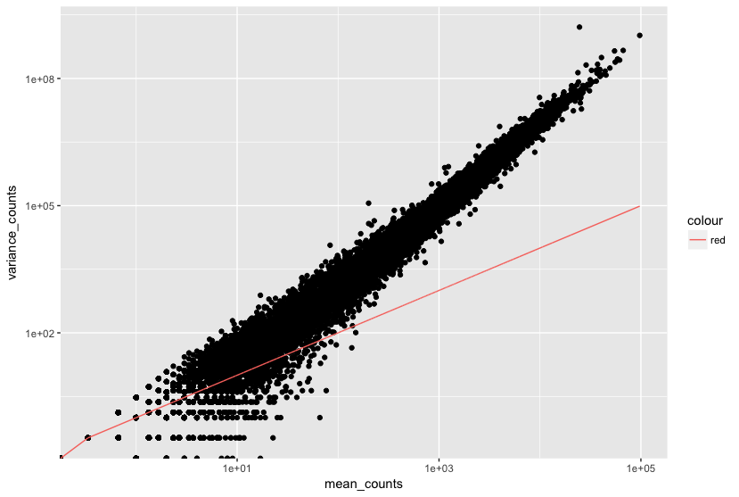

[GEO]: https://www.ncbi.nlm.nih.gov/geo/query/acc.cgi?acc=GSE51443 "Gene Expression Omnibus"
[SRA]: https://trace.ncbi.nlm.nih.gov/Traces/sra/?study=SRP031507 "Sequence Read Archive"

Приблизительное время: 60 минут

## Цели урока

* Объяснить эксперимент и его цели.
* Описать, как настроить проект RNA-seq в R
* Описать последовательность операций RNA-seq и дифференциального анализа экспрессии генов.
* Объяснить, почему отрицательное биномиальное распределение используется для моделирования данных о числе прочтений RNA-seq.


# Обзор анализа дифференциальной экспрессии генов (Differential Gene Expression, DGE)

Целью RNA-seq зачастую является оценка дифференциальной экспрессии для того, чтобы определить какие гены экспрессируются на разных уровнях при разных условиях _(conditions)_. Эти гены могут дать биологическое представление о процессах, на которые влияет интересующее(ые) условие(я) .


Для определения уровней экспрессии генов наш алгоритм RNA-seq следовал шагам, подробно описанным на рисунке ниже. Все шаги выполнялись в командной строке (Linux/Unix) вплоть до вычисления количества прочтений для каждого гена. Анализ дифференциальной экспрессии и любой последующий функциональный анализ обычно выполняются в R с использованием пакетов R, специально разработанных для сложного статистического анализа, необходимого для определения дифференциальной экспрессии генов.


В следующих нескольких уроках мы пройдем с вами **полный цикл обработки дифференциальной экспрессии РНК-секвенирования на уровне генов** с использованием различных пакетов R. Мы начнем с матрицы числа прочтений _(count matrix)_, проведем предварительный анализ данных для оценки качества и выяснения взаимосвязи между образцами, выполним анализ дифференциальной экспрессии и визуально изучим результаты перед проведением последующего функционального анализа.


## Описание набора данных

Мы будем использовать общую числовую матрицу (count matrix) из набора данных RNA-Seq, который является частью более крупного исследования, описанного в статье [Kenny PJ et al, Cell Rep 2014](http://www.ncbi.nlm.nih.gov/pubmed/25464849).

Исследование RNA-Seq проводилось на клетках HEK293F, которые были трансфицированы либо трансгеном MOV10, либо [малой интерферирующей РНК](https://ru.wikipedia.org/wiki/%D0%9C%D0%B0%D0%BB%D1%8B%D0%B5_%D0%B8%D0%BD%D1%82%D0%B5%D1%80%D1%84%D0%B5%D1%80%D0%B8%D1%80%D1%83%D1%8E%D1%89%D0%B8%D0%B5_%D0%A0%D0%9D%D0%9A) _(siRNA)_ для нокдауна _(knock down)_ Mov10, либо неспецифической (нерелевантной) siRNA. В результате были получены 3 состояния _(condition)_ **Mov10 oe** (избыточная экспрессия), **Mov10 kd** (нокдаун) и **Irrelevant kd**, соответственно. Число биологических повторов _(Replicate)_ указано ниже.

С помощью этих данных мы оценим транскрипционные паттерны, связанные с нарушением экспрессии MOV10. Обратите внимание, что нерелевантная siRNA будет рассматриваться в качестве контрольного состояния.


***Каково назначение этих датасетов? Какое действие оказывает Mov10?***

Авторы исследуют взаимодействия между различными генами, вовлеченными в формирование [синдрома ломкой X-хромосомы](https://ru.wikipedia.org/wiki/%D0%A1%D0%B8%D0%BD%D0%B4%D1%80%D0%BE%D0%BC_%D0%9C%D0%B0%D1%80%D1%82%D0%B8%D0%BD%D0%B0_%E2%80%94_%D0%91%D0%B5%D0%BB%D0%BB) -- болезни, для которой характерна аберрантная продукция белка FMRP.

>**FMRP** «чаще всего обнаруживается в головном мозге, он необходим для нормального умственного развития и женской репродуктивной функции. Мутации в этом гене могут привести к синдрому ломкой Х-хромосомы, умственной отсталости, преждевременной недостаточности яичников, аутизму, болезни Паркинсона, задержке развития и другим когнитивным нарушениям». - из [википедии](https://en.wikipedia.org/wiki/FMR1)


> **MOV10** - это предполагаемая РНК-геликаза, ассоциированная с **FMRP** в контексте регуляции с помощью микроРНК.

**[В статье](http://www.ncbi.nlm.nih.gov/pubmed/25464849) проверяется гипотеза о том, что FMRP и MOV10 связывают и регулируют трансляцию подмножества РНК**.


**Наши вопросы:**
* Какие паттерны экспрессии мы можем идентифицировать в связи с потерей или приростом MOV10?
* Есть ли общие гены для этих двух состояний?

## Установка

Прежде чем перейти к деталям анализа, давайте начнем с запуска RStudio и создания нового проекта для нашего анализа.

1. Перейдите в меню `File` и выберите `New Project`.
2. В окне `New Project` _(Новый проект)_ выберите `New Directory` _(Новая папка)_. Затем выберите `Empty Project` _(Пустой проект)_. Назовите новый каталог `DEanalysis`, а затем "Create the project as subdirectory of:" на Рабочем столе _(Desktop)_ (или в выбранном вами месте).
3. Новый проект должен автоматически открыться в RStudio.

Чтобы проверить, находитесь ли вы в правильном рабочем каталоге, используйте `getwd()`. В консоли должен появиться путь `Desktop/DEanalysis`. В рабочей директории используйте кнопку `New Directory` _(Новая папка)_ в правой нижней панели, чтобы создать три новые директории: `data`, `meta` и `results`. Помните, что ключ к хорошему анализу - это систематизированность от начала до конца!

Перейдите в меню `File` _(Файл)_ и выберите `New File` _(Новый файл)_, затем выберите `R Script` _(Скрипт R)_. В левом верхнем углу откроется редактор скриптов. Именно здесь мы будем вводить и сохранять все команды, необходимые для данного анализа. В редакторе скриптов введите строки заголовков:

```r
## Gene-level differential expression analysis using DESeq2
```
> **NOTE:** В зависимости от настроек операционной системы редактор скриптов Rstudio может некорректно воспринимать рускоязычные символы. Нужно быть внимательным, поскольку при последующем открытии таких файлов текстовый редактор может неправильно отображать русский алфавит*

Теперь сохраните файл под именем `de_script.R`. После завершения работы ваш рабочий каталог должен выглядеть примерно так:


Наконец, нам нужно получить файлы, с которыми мы будем работать для анализа. Щелкните правой кнопкой мыши на ссылках ниже и выберите опцию "Сохранить ссылку как ..." _("Save link as ...")_ для загрузки:

* Созхраните файл [full counts matrix](https://raw.githubusercontent.com/hbc/NGS_Data_Analysis_Course/master/sessionIII/data/Mov10_full_counts.txt) в директории `data`.
* Сохраните файл [full metadata table](https://raw.githubusercontent.com/hbc/NGS_Data_Analysis_Course/master/sessionIII/data/Mov10_full_meta.txt) в директории `meta`.

### Загрузка библиотек

Для этого анализа мы будем использовать несколько пакетов R, некоторые из которых были установлены из CRAN, а другие - из Bioconductor. Чтобы использовать эти пакеты (и содержащиеся в них функции), нам нужно **загрузить библиотеки.** Добавьте следующие строки в ваш скрипт и не забудьте оставлять подробные комментарии!

```r
## Setup
### Bioconductor and CRAN libraries used
library(tidyverse)
library(RColorBrewer)
library(DESeq2)
library(pheatmap)
library(DEGreport)
```

### Загрузка данных

Для загрузки данных в нашу текущую рабочую среду _(Environment)_ мы будем использовать функцию `read.table`. Нам нужно указать путь к каждому файлу, а также указать аргументы, чтобы сообщить R, что у нас есть заголовок (`header = T`), и что первый столбец - это имена наших строк (`row.names =1`). По умолчанию функция ожидает файлы с табуляцией в качестве разделителя, что мы и имеем.

```r
## Load in data
data <- read.table("data/Mov10_full_counts.txt", header=T, row.names=1)

meta <- read.table("meta/Mov10_full_meta.txt", header=T, row.names=1)
```

Используйте `class()` для проверки наших данных и убедитесь, что мы работаем с таблицами данных _(data frames)_:

```r
### Check classes of the data we just brought in
class(meta)
class(data)
```

### Просмотр данных

Убедитесь, что ваши датасеты содержат требуемые образцы плюс информацию, прежде чем приступить к выполнению любого вида анализа.

```r
View(meta)
View(data)
```

> ### Using the abundance estimates from Salmon as input to DESeq2
> The counts used in these lessons were generated using the standard approach for RNA-seq analysis, where samples were aligned to the genome using a splice-aware aligner followed by counting. If you are using lightweight algorithms such as Salmon, Sailfish or Kallisto to generate abundance estimates, you can also use DESeq2 to perform gene-level differential expression analysis. These transcript abundance estimates, often referred to as ‘pseudocounts’, can be converted for use with DESeq2 but the setup is slightly more involved. If you are interested in knowing more about using Salmon pseudocounts for DESeq2, we have [materials linked here](https://hbctraining.github.io/DGE_workshop_salmon/lessons/01_DGE_setup_and_overview.html).

## Обзор анализа дифференциальной экспрессии

Что же на самом деле представляют собой эти числовые данные _(count data)_? Числовые показатели _(counts)_, используемые для анализа дифференциальной экспрессии, представляют собой количество прочтений _(reads)_ для последовательностей, относящихся к определенному гену. Чем выше значение показателя, тем больше прочтений связано с этим геном, и тем выше уровень экспрессии этого гена в образце.


С помощью анализа дифференциальной экспрессии мы ищем гены, экспрессия которых меняется между двумя или более группами (определенными в метаданных).
- опыт против контроля
- корреляция экспрессии с какой-либо переменной или клиническим проявлением

**Почему не получается определить дифференциально экспрессируемый ген, ранжируя гены по тому, насколько они отличаются между двумя группами (на основе величины диапазона изменений _([(Fold Change)](https://ru.wikipedia.org/wiki/%D0%9A%D1%80%D0%B0%D1%82%D0%BD%D0%BE%D1%81%D1%82%D1%8C_%D0%B8%D0%B7%D0%BC%D0%B5%D0%BD%D0%B5%D0%BD%D0%B8%D1%8F))?**


More often than not, there is much more going on with your data than what you are anticipating. Genes that vary in expression level between samples is a consequence of not only the experimental variables of interest but also due to extraneous sources. The goal of differential expression analysis to determine the relative role of these effects, and to separate the “interesting” from the “uninteresting”.


The "uninteresting" presents as sources of variation in your data, and so even though the mean expression levels between sample groups may appear to be quite different, it is possible that the difference is not actually significant. This is illustrated for 'GeneA' expression between 'untreated' and 'treated' groups in the figure below. The mean expression level of geneA for the 'treated' group is twice as large as for the 'untreated' group, but the variation between replicates indicates that this may not be a significant difference. **We need to take into account the variation in the data (and where it might be coming from) when determining whether genes are differentially expressed.**


The goal of differential expression analysis is to determine, for each gene, whether the differences in expression (counts) **between groups** is significant given the amount of variation observed **within groups** (replicates). To test for significance, we need an appropriate statistical model that accurately performs normalization (to account for differences in sequencing depth, etc.) and variance modeling (to account for few numbers of replicates and large dynamic expression range).


### RNA-seq count distribution

To determine the appropriate statistical model, we need information about the distribution of counts. To get an idea about how RNA-seq counts are distributed, let's plot the counts for a single sample, 'Mov10_oe_1':

```r
ggplot(data) +
  geom_histogram(aes(x = Mov10_oe_1), stat = "bin", bins = 200) +
  xlab("Raw expression counts") +
  ylab("Number of genes")
```


If we zoom in close to zero, we can see a large number of genes with counts of zero:

```r
ggplot(data) +
   geom_histogram(aes(x = Mov10_oe_1), stat = "bin", bins = 200) +
   xlim(-5, 500)  +
   xlab("Raw expression counts") +
   ylab("Number of genes")
```


These images illustrate some common features of RNA-seq count data, including a **low number of counts associated with a large proportion of genes**, and a long right tail due to the **lack of any upper limit for expression**. Unlike microarray data, which has a dynamic range maximum limited due to when the probes max out, there is no limit of maximum expression for RNA-seq data. Due to the differences in these technologies, the statistical models used to fit the data are different between the two methods.

> **NOTE:** The log intensities of the microarray data approximate a normal distribution. However, due to the different properties of the of RNA-seq count data, such as integer counts instead of continuous measurements and non-normally distributed data, the normal distribution does not accurately model RNA-seq counts [[1](https://www.ncbi.nlm.nih.gov/pmc/articles/PMC3541212/)].

### Modeling count data

Count data is often modeled using the **binomial distribution**, which can give you the **probability of getting a number of heads upon tossing a coin a number of times**. However, not all count data can be fit with the binomial distribution. The binomial is based on discrete events and used in situations when you have a certain number of cases.

When **the number of cases is very large (i.e. people who buy lottery tickets), but the probability of an event is very small (probability of winning)**, the **Poisson distribution** is used to model these types of count data. The Poisson is similar to the binomial, but is based on continuous events. [Details provided by Rafael Irizarry in the EdX class.](https://youtu.be/fxtB8c3u6l8)

**With RNA-Seq data, a very large number of RNAs are represented and the probability of pulling out a particular transcript is very small**. Thus, it would be an appropriate situation to use the Poisson distribution. However, a unique property of this distribution is that the mean == variance. Realistically, with RNA-Seq data there is always some biological variation present across the replicates (within a sample class). Genes with larger average expression levels will tend to have larger observed variances across replicates.

If the proportions of mRNA stayed exactly constant between the biological replicates for each sample class, we could expect Poisson distribution (where mean == variance). [A nice description of this concept is presented by Rafael Irizarry in the EdX class](https://youtu.be/HK7WKsL3c2w). But this doesn't happen in practice, and so the Poisson distribution is only  considered appropriate for a single biological sample.

The model that fits best, given this type of variability between replicates, is the Negative Binomial (NB) model. Essentially, **the NB model is a good approximation for data where the mean < variance**, as is the case with RNA-Seq count data.


>**NOTE:**
>
> - **Biological replicates** represent multiple samples (i.e. RNA from different mice) representing the same sample class
> - **Technical replicates** represent the same sample (i.e. RNA from the same mouse) but with technical steps replicated
> - Usually biological variance is much greater than technical variance, so we do not need to account for technical variance to identify biological differences in expression
> - **Don't spend money on technical replicates - biological replicates are much more useful**

>**NOTE:**
> If you are using **cell lines** and are unsure whether or not you have prepared biological or technical replicates, take a look at [this link](https://web.archive.org/web/20170807192514/http://www.labstats.net:80/articles/cell_culture_n.html). This is a useful resource in helping you determine how best to set up your *in-vitro* experiment.

#### How do I know if my data should be modeled using the Poisson distribution or Negative Binomial distribution?

If it's count data, it should fit the negative binomial, as discussed previously. However, it can be helpful to plot the *mean versus the variance* of your data. *Remember for the Poisson model, mean = variance, but for NB, mean < variance.*

Запустите следующий код, чтобы построить график *среднее значение vs дисперсии* для повторов  'Mov10 overexpression':

```r
mean_counts <- apply(data[, 3:5], 1, mean)
variance_counts <- apply(data[, 3:5], 1, var)
df <- data.frame(mean_counts, variance_counts)

ggplot(df) +
        geom_point(aes(x=mean_counts, y=variance_counts)) +
        geom_line(aes(x=mean_counts, y=mean_counts, color="red")) +
        scale_y_log10() +
        scale_x_log10()
```



Обратите внимание, что на рисунке выше дисперсия между повторами имеет тенденцию превышать среднее значение (красная линия), особенно в случае генов с высоким средним уровнем экспрессии. *Это верный признак того, что наши данные не соответствуют распределению Пуассона, и нам необходимо учесть это увеличение дисперсии с помощью модели с негативным биномиальным распределенем (т.е. модель с Пуассоновским распределением будет недооценивать вариабельность, что приведет к увеличению числа ложноположительных DE-генов).*

### Усовершенствование  оценок среднего (т.е. уменьшение дисперсии) с помощью биологических повторов

Дисперсия или разброс имеет тенденцию к уменьшению по мере увеличения числа биологических реплик (*распределение будет приближаться к пуассоновскому при увеличении числа повторов*), поскольку стандартные отклонения средних меньше, чем стандартные отклонения отдельных наблюдений. **Ценность дополнительных повторов заключается в том, что по мере добавления большего количества данных (повторов) вы получаете все более точные оценки групповых средних и, в конечном счете, большую доверие (confidence) к способности выявлять различия между классами образцов (т.е. более DE-генов).**

На рисунке ниже показано влияние глубины секвенирования и числа повторов на количество выявленных дифференциально экспрессируемых генов [[1](https://academic.oup.com/bioinformatics/article/30/3/301/228651/RNA-seq-differential-expression-studies-more)]. Обратите внимание, что **увеличение числа реплик, как правило, дает больше DE-генов, чем увеличение глубины секвенирования**. Поэтому, как правило, большее количество повторов лучше, чем большая глубина секвенирования, с оговоркой, что большая глубина требуется для обнаружения слабо экспрессируемых DE-генов и для проведения дифференциальной экспрессии на уровне отдельных изоформ. Обычно рекомендуемая минимальная глубина секвенирования составляет 20-30 миллионов прочтений на образец, но мы видели хорошие эксперименты РНК-секвенирования с 10 миллионами прочтений при наличии достаточного количества повторов.

Переведено с помощью www.DeepL.com/Translator (бесплатная версия)


### Процедура анализа дифференциальной экспрессии

Чтобы правильно смоделировать числовые показатели при проведении анализа дифференциальной экспрессии, существует ряд пакетов программного обеспечения, разработанных для анализа дифференциальной экспрессии данных RNA-seq. Несмотря на то, что постоянно разрабатываются новые методы, несколько инструментов обычно рекомендуются в качестве наиболее эффективных, например: **[DESeq2](https://bioconductor.org/packages/release/bioc/html/DESeq2.html)** и **[EdgeR](https://bioconductor.org/packages/release/bioc/html/edgeR.html)**. Оба инструмента используют отрицательную биномиальную модель, применяют схожие методы и, как правило, дают схожие результаты. Они довольно строгие и имеют хороший баланс между чувствительностью _(sensitivity)_ и специфичностью _(specificity)_ (сниженное количество как ложноположительных и ложноотрицательных результатов).

**[Limma-Voom](https://genomebiology.biomedcentral.com/articles/10.1186/gb-2014-15-2-r29)** еще один набор инструментов, часто используемых вместе для анализа DE, но этот метод может быть менее чувствительным при малых объемах выборки. Этот метод рекомендуется использовать, когда число биологических повторов на группу становится большим (> 20).

Многие исследования, описывающие сравнение между этими методами, показывают, что, несмотря на определенное соответствие, между инструментами также существуют значительные различия. **Кроме того, не существует одного метода, который был бы оптимален при любых условиях ([Soneson and Dleorenzi, 2013](https://bmcbioinformatics.biomedcentral.com/articles/10.1186/1471-2105-14-91)).**


**Для анализа дифференциальной экспрессии _(DE)_ мы будем использовать [DESeq2](https://genomebiology.biomedcentral.com/articles/10.1186/s13059-014-0550-8) а этапы анализа с помощью DESeq2 показаны зеленым цветом на блок-схеме ниже.**  DESeq2 сначала нормализует числовые данные, чтобы учесть различия в размерах библиотек и составе РНК между образцами. Затем мы воспользуемся нормализованными значениями для построения некоторых графиков для контроля качества на уровне генов и образцов. Последний шаг - использование соответствующих функций из пакета DESeq2 для проведения анализа дифференциальной экспрессии.


Мы подробно рассмотрим каждый из этих шагов в следующих уроках, но дополнительные подробности и полезные рекомендации по DESeq2 можно найти в [DESeq2 vignette].(http://bioconductor.org/packages/devel/bioc/vignettes/DESeq2/inst/doc/DESeq2.html). По мере выполнения работы и возникновения вопросов вы можете обратиться к виньетке из RStudio:

```
vignette("DESeq2")
```

Это очень удобно, так как позволяет держать под рукой огромное количество информации! Обязательно используйте ее по мере необходимости во время семинара.


***
*This lesson has been developed by members of the teaching team at the [Harvard Chan Bioinformatics Core (HBC)](http://bioinformatics.sph.harvard.edu/). These are open access materials distributed under the terms of the [Creative Commons Attribution license](https://creativecommons.org/licenses/by/4.0/) (CC BY 4.0), which permits unrestricted use, distribution, and reproduction in any medium, provided the original author and source are credited.*
